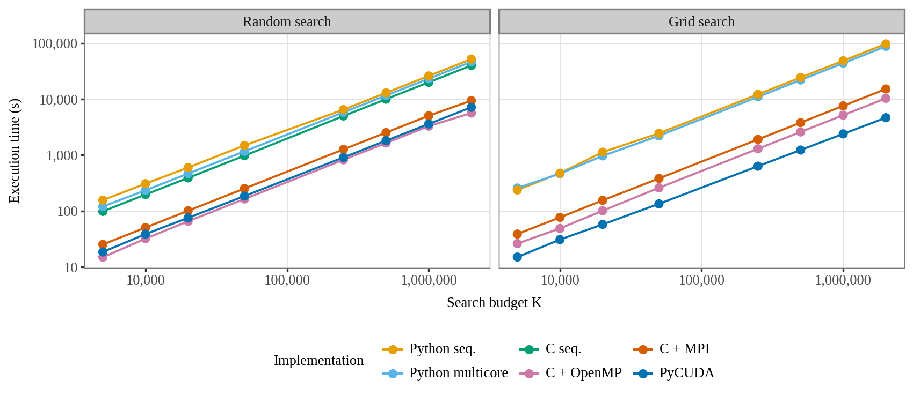
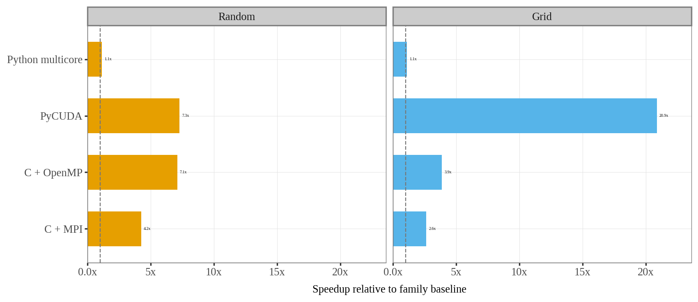
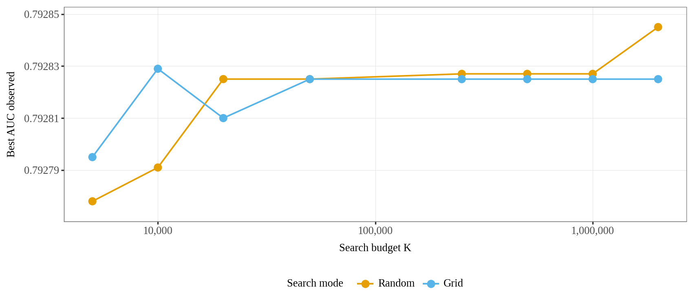
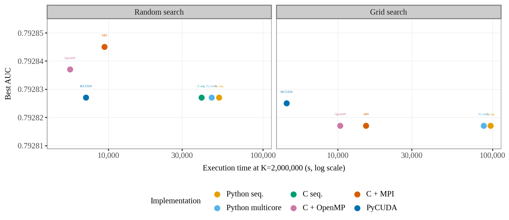
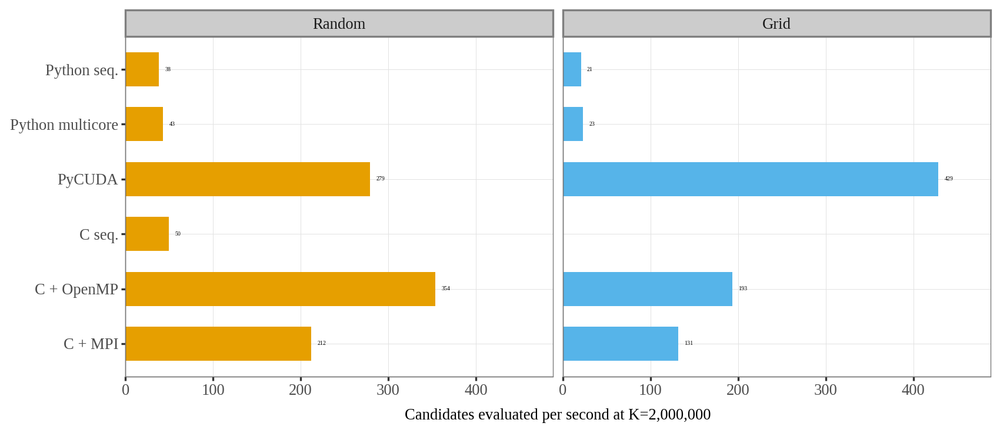

# Benchmark

## Objetivo

Comparacion pareada **random vs grid** sobre el mismo dataset, semilla y presupuestos K. El benchmark busca comparar las implementaciones del sistema en terminos de:

- **Tiempo de ejecucion:** cuanto tarda cada implementacion en evaluar K candidatos.
- **Speedup:** ganancia de velocidad respecto al baseline de su familia (Python o C).
- **Eficiencia:** que tan bien escala cada implementacion al aumentar las unidades de paralelismo.
- **Throughput:** candidatos evaluados por segundo.
- **Calidad de la solucion:** AUC del mejor W encontrado.
- **Convergencia:** iteracion en la que aparece el mejor resultado.

El objetivo pedagogico no es solo medir velocidad, sino mostrar como cambia el costo computacional y la calidad del scoring al variar la estrategia de busqueda y el paradigma de implementacion (Python, C, GPU).

## Metricas base

### Tiempo (T)

Tiempo de busqueda medido desde el inicio de la generacion/evaluacion de candidatos hasta la obtencion del mejor resultado. Excluye el tiempo de carga de datos desde disco, que es comun a todas las implementaciones.

### Speedup (S)

Dos variantes usadas en las graficas:

```
S_python = T_python_sequential / T_impl    # para implementaciones Python y PyCUDA
S_c      = T_c_sequential / T_impl         # para implementaciones C
```

El speedup contra baseline propio permite comparar paralelizaciones dentro de cada familia sin mezclar el overhead de Python con el de C.

**Nota sobre baselines en grid:** el CSV incluye `c_sequential` solo en random. Para calcular speedup de implementaciones C en grid, se usa `c_sequential` random como referencia de lenguaje; esto se declara explicitamente en las graficas para no mezclar estrategia con paralelizacion.

### Eficiencia (E)

```
E = S / P
```

Donde P es el numero de unidades de paralelismo:

- Para Python multicore: numero de workers (procesos).
- Para C OpenMP: numero de hilos.
- Para C MPI: numero de ranks (procesos MPI).

La eficiencia ideal es 1.0 (speedup lineal). Valores menores indican overhead de paralelizacion (comunicacion, sincronizacion, desbalanceo de carga).

### Throughput

```
Throughput = K / T
```

Mide cuantos candidatos se evaluan por segundo. Es util para comparar implementaciones con diferentes K, aunque la relacion no es perfectamente lineal debido a overheads fijos.

## Consideraciones especificas por implementacion

### GPU (PyCUDA)

Para la implementacion GPU, la metrica P corresponde al numero de multiprocesadores (SM) de la GPU. Sin embargo, la eficiencia calculada como `S / SM_count` no es directamente comparable con la eficiencia de CPU por las siguientes razones:

- Cada SM ejecuta multiples warps (32 hilos) simultaneamente, no un solo hilo.
- El paralelismo GPU es masivo (miles de hilos) y no saturado con P unidades.
- La frecuencia de reloj de los nucleos GPU es menor que la de CPU.

Por lo tanto, para GPU se recomienda:

- Reportar **throughput** (candidatos/segundo) como metrica principal.
- Reportar **speedup** respecto a Python secuencial como metrica secundaria.
- La eficiencia puede reportarse como metrica heuristica con la nota de que `P = SM_count` no representa unidades de ejecucion equivalentes a hilos/procesos CPU.

### MPI en una sola maquina

Ejecutar MPI en una sola maquina mide principalmente el overhead de comunicacion MPI (buffers, sockets locales) y no la escalabilidad real en un cluster. Los resultados de speedup y eficiencia en una sola maquina tienden a ser peores que en un cluster debido a que la comunicacion compite con el computo por los mismos recursos.

## Parametros del benchmark

### Medicion principal (`results/benchmark.csv`)

**88 filas validas** (11 configuraciones x 8 valores de K). Cada implementacion se evalua en **random** y **grid** bajo las mismas condiciones.

| Parametro | Valor |
|---|---|
| Dataset | `synthetic_CRC2000x10000_balanced` (10 000 items, 2 000 muestras) |
| Estrategias | `random` y `grid` (comparacion pareada) |
| Seed | 42 |
| Valores de K | 5 000, 10 000, 20 000, 50 000, 250 000, 500 000, 1 000 000, 2 000 000 |
| Implementaciones | Python secuencial, Python multicore, C secuencial (solo random), C + OpenMP, C + MPI, PyCUDA |
| Paralelismo | 8 workers/hilos/ranks (CPU); 14 SMs (PyCUDA) |
| Hardware | Intel Core i5-10300H (4C/8T), 23.3 GB RAM, NVIDIA GTX 1650 (896 CUDA cores) |

### Variables tipicas en otras ejecuciones

| Parametro | Valores tipicos | Proposito |
|---|---|---|
| K | 5 000 … 2 000 000 | Evaluar escalabilidad con la carga de trabajo |
| Workers/Threads/Ranks | 1, 2, 4, 8 | Evaluar escalabilidad con el paralelismo |
| Estrategia | random, grid, hybrid | Comparar calidad vs. costo |
| Implementacion | todas las disponibles | Comparar paradigmas |

## Pipeline de ejecucion

### Metodo 1: run_all.sh

```bash
./run_all.sh
```

Ejecuta todas las implementaciones disponibles con configuracion por defecto y genera `results/benchmark_raw.csv`.

### Metodo 2: make benchmark

```bash
make benchmark K="5000 10000 20000" SEARCH=random
```

Ejecuta el pipeline `scripts/benchmark_pipeline.py` con deteccion de hardware y genera `results/benchmark.csv` con columnas enriquecidas (CPU, GPU, RAM).

### Metodo 3: benchmark_pipeline.py

```bash
python scripts/benchmark_pipeline.py \
    --all-strategies \
    --search random \
    --k 5000 10000 20000 \
    --output results/benchmark_pipeline.csv
```

Pipeline avanzado que permite seleccionar estrategias, valores de K, workers, y detecta automaticamente el hardware (modelo de CPU, cores fisicos/logicos, RAM, modelo de GPU, cores CUDA, memoria GPU).

## Validacion de resultados

El script `scripts/validate_benchmark_csv.py` verifica que el archivo CSV de salida cumpla con:

- Cabecera correcta.
- Valores numericos validos en todas las columnas.
- Nombres de implementacion dentro del conjunto esperado.
- Modos de busqueda dentro del conjunto esperado.
- Ausencia de caracteres ANSI o de caja (indicadores de salida de log en lugar de modo benchmark).

## Resultados destacados

### K = 2 000 000 — random search (seed 42)

| Implementacion | Tiempo (s) | Tiempo (h) | AUC | Throughput (cand/s) | Speedup vs baseline propio |
|---|---|---|---|---|---|
| c_openmp | 5 650.1 | 1.57 | 0.792837 | 354.0 | 7.09x vs c_sequential |
| pycuda | 7 160.2 | 1.99 | 0.792827 | 279.3 | 7.27x vs python_sequential |
| c_mpi | 9 434.9 | 2.62 | 0.792845 | 212.0 | 4.25x vs c_sequential |
| c_sequential | 40 083.8 | 11.13 | 0.792827 | 49.9 | 1.00x (baseline C) |
| python_multicore | 46 586.5 | 12.94 | 0.792827 | 42.9 | 1.12x vs python_sequential |
| python_sequential | 52 033.0 | 14.45 | 0.792827 | 38.4 | 1.00x (baseline Python) |

### K = 2 000 000 — grid search (seed 42)

| Implementacion | Tiempo (s) | Tiempo (h) | AUC | Throughput (cand/s) | Speedup vs baseline propio |
|---|---|---|---|---|---|
| pycuda | 4 665.5 | 1.30 | 0.792825 | 428.7 | 20.9x vs python_sequential grid |
| c_openmp | 10 359.5 | 2.88 | 0.792817 | 193.1 | 3.87x vs c_sequential random* |
| c_mpi | 15 222.2 | 4.23 | 0.792817 | 131.4 | 2.63x vs c_sequential random* |
| python_multicore | 87 968.3 | 24.44 | 0.792817 | 22.7 | 1.11x vs python_sequential grid |
| python_sequential | 97 410.3 | 27.06 | 0.792817 | 20.5 | 1.00x (baseline Python grid) |

\* Baseline C tomado de `c_sequential` random (no existe `c_sequential` grid en el benchmark).

**Lectura integrada:**

- **Tiempo:** crece casi proporcionalmente con K en ambas estrategias. En random, C + OpenMP es el mas rapido en CPU (5 650.1 s); en grid, PyCUDA lidera (4 665.5 s). La GPU aporta mas ventaja cuando la exploracion es sistematica (grid) que cuando es estocastica (random).
- **Calidad:** el AUC se concentra alrededor de 0.7928 en todos los casos. Random alcanza el mejor valor global (0.792845, C + MPI); grid converge rapido pero se estanca cerca de 0.792825. La diferencia importante no es la calidad, sino el costo computacional para llegar a ella.
- **Speedup:** en K = 2 000 000, PyCUDA-grid logra el mayor speedup relativo (20.9x frente a Python secuencial grid), mientras C + OpenMP-random obtiene el mejor speedup CPU (7.1x frente a C secuencial).
- **Recomendacion practica:** si solo hay CPU, C + OpenMP con random search ofrece el mejor equilibrio tiempo-AUC. Si hay GPU disponible y la estrategia es grid, PyCUDA domina en tiempo y throughput sin sacrificar calidad de forma relevante.

## Graficas

Archivos en `results/plots/` (PNG). Datos fuente: `results/benchmark.csv`.

| Figura | Archivo | Contenido |
|---|---|---|
| Fig. 1 | [`fig1_runtime_random_grid.png`](../results/plots/fig1_runtime_random_grid.png) | Tiempo de ejecucion vs K (random y grid) |
| Fig. 2 | [`fig2_speedup_random_grid.png`](../results/plots/fig2_speedup_random_grid.png) | Speedup vs baseline propio por familia |
| Fig. 3 | [`fig3_auc_random_grid.png`](../results/plots/fig3_auc_random_grid.png) | Convergencia del AUC (random y grid) |
| Fig. 4 | [`fig4_pareto_random_grid.png`](../results/plots/fig4_pareto_random_grid.png) | Relacion costo-calidad en K = 2 000 000 |
| Fig. 5 | [`fig5_throughput_random_grid.png`](../results/plots/fig5_throughput_random_grid.png) | Throughput (candidatos/s) en K = 2 000 000 |

### Figura 1. Tiempo de ejecucion por estrategia

**Archivo:** [`fig1_runtime_random_grid.png`](../results/plots/fig1_runtime_random_grid.png)



El tiempo crece casi proporcionalmente con K en ambas estrategias. En random, C + OpenMP es el mas rapido al mayor presupuesto (5 650.1 s en K = 2 000 000); en grid, PyCUDA queda primero (4 665.5 s). Lectura practica: para CPU gana OpenMP, mientras que grid se beneficia especialmente de la GPU.

### Figura 2. Speedup con baseline propio

**Archivo:** [`fig2_speedup_random_grid.png`](../results/plots/fig2_speedup_random_grid.png)



El speedup se calcula contra el baseline de su propia familia: Python multicore frente a Python secuencial, PyCUDA frente a Python secuencial y C/OpenMP-MPI frente a C secuencial random (porque el benchmark no incluye C secuencial grid). En K = 2 000 000, PyCUDA-grid logra el mayor speedup relativo (20.9x), mientras C + OpenMP-random alcanza el mejor speedup CPU (7.1x).

### Figura 3. Convergencia de AUC

**Archivo:** [`fig3_auc_random_grid.png`](../results/plots/fig3_auc_random_grid.png)



La calidad del scoring cambia muy poco: todos los valores quedan alrededor de 0.7928. Random alcanza el mejor AUC final (0.792845, C + MPI), mientras grid llega rapido a una zona competitiva pero se estanca cerca de 0.792825 al mayor K. La leccion pedagogica: paralelizar o cambiar de lenguaje acelera la busqueda sin alterar sustancialmente la calidad del mejor W encontrado.

### Figura 4. Pareto tiempo vs AUC

**Archivo:** [`fig4_pareto_random_grid.png`](../results/plots/fig4_pareto_random_grid.png)



El grafico Pareto separa rendimiento y calidad. En random, C + OpenMP ofrece el mejor equilibrio tiempo-AUC; C + MPI obtiene el AUC mas alto, pero tarda mas. En grid, PyCUDA domina en tiempo, aunque no alcanza el mejor AUC global de random. Esta es la figura mas util para justificar la implementacion recomendada en una sustentacion.

### Figura 5. Throughput final

**Archivo:** [`fig5_throughput_random_grid.png`](../results/plots/fig5_throughput_random_grid.png)



El throughput confirma la misma historia en una metrica mas intuitiva. PyCUDA-grid procesa mas candidatos por segundo (428.7 cand/s) y C + OpenMP-random es el mejor caso CPU (354.0 cand/s). Python queda muy por debajo, incluso con multiprocessing, lo que evidencia overhead de procesos y menor eficiencia de ejecucion.

## Criterios de validacion de resultados

Los resultados del benchmark deben cumplir:

- **AUC > 0.7:** el scoring debe ser significativamente mejor que el azar (0.5).
- **Consistencia >= 0.8:** debe existir un umbral con balanced accuracy satisfactorio.
- **Speedup creciente con P:** a mas unidades de paralelismo, mayor velocidad (o al menos no empeorar).
- **Repetibilidad:** ejecuciones con la misma configuracion deben producir AUC similares.
- **Correccion numerica:** con la misma estrategia, K y semilla, `random` y `grid` deben coincidir entre implementaciones dentro de tolerancia (~1e-6). En `hybrid`, los resultados pueden diferir porque cada implementacion usa una variante distinta de particion de fases (ver [10_estrategias_busqueda.md](10_estrategias_busqueda.md)).
